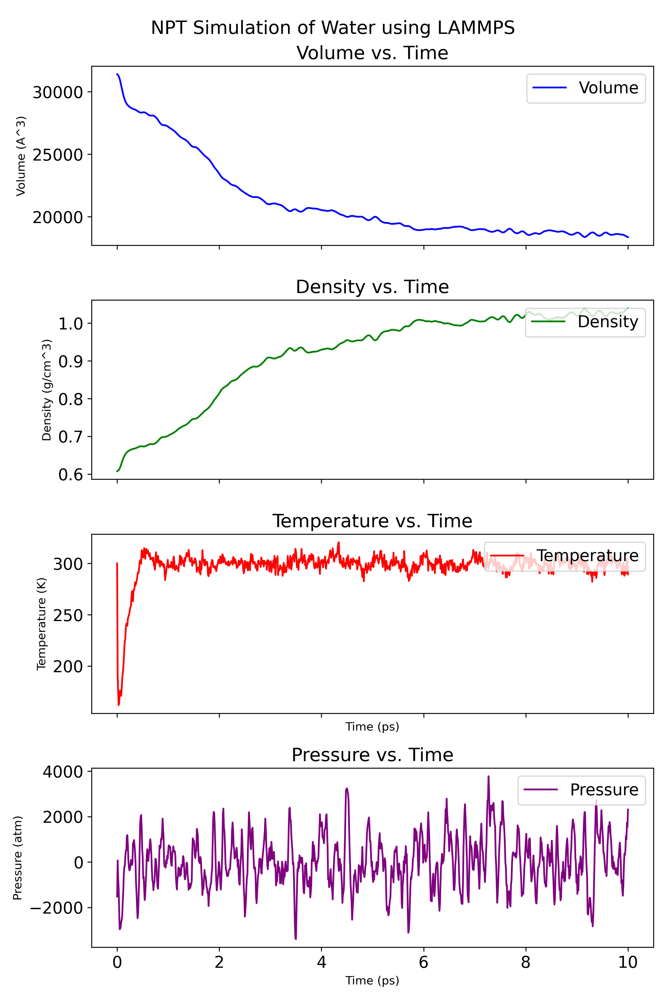
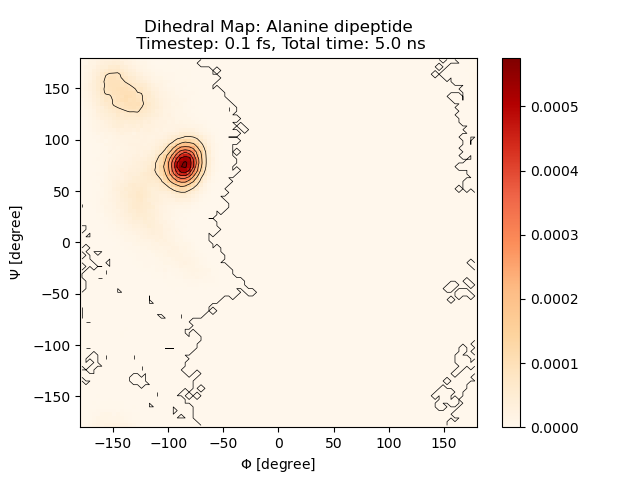
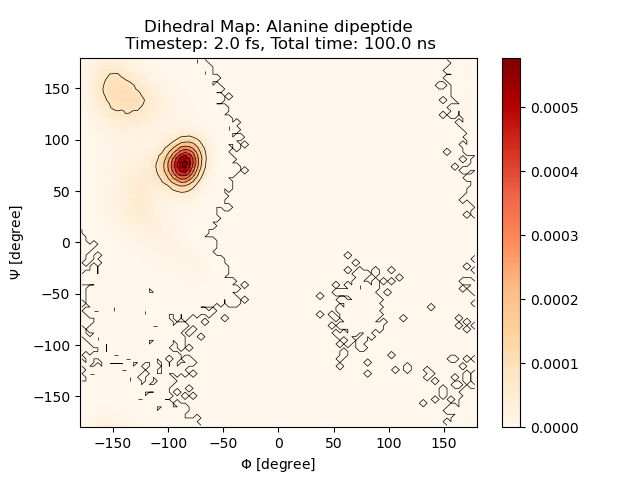
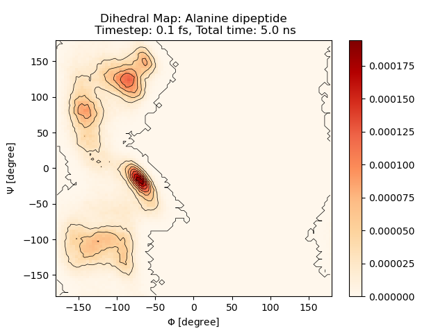
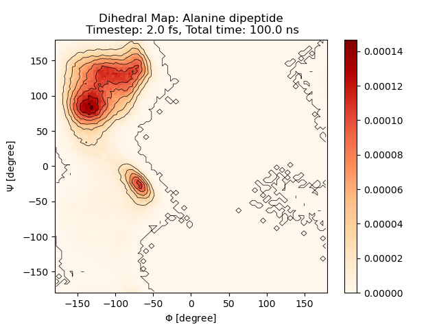
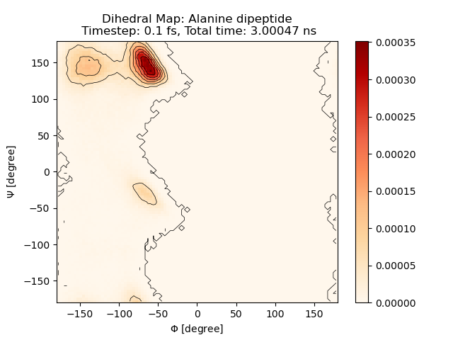
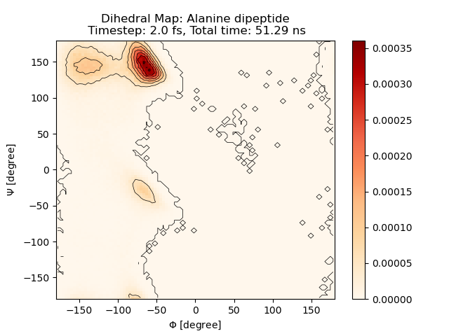
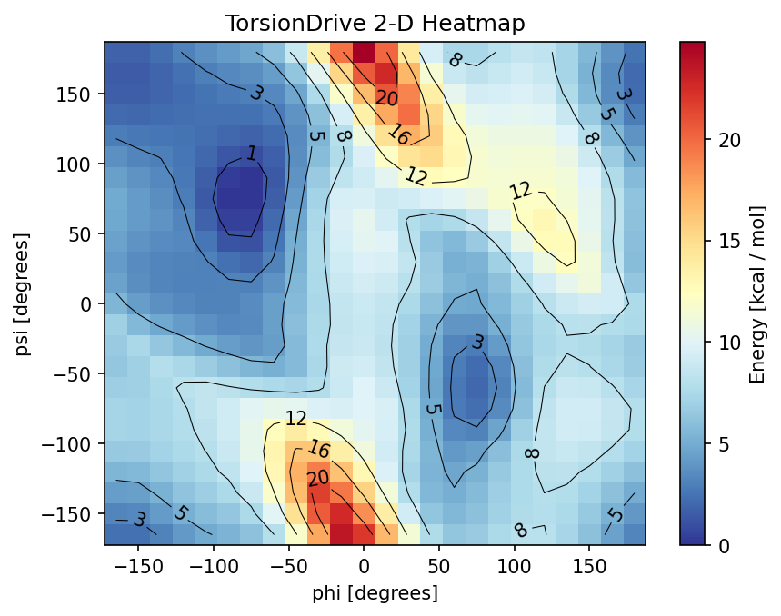
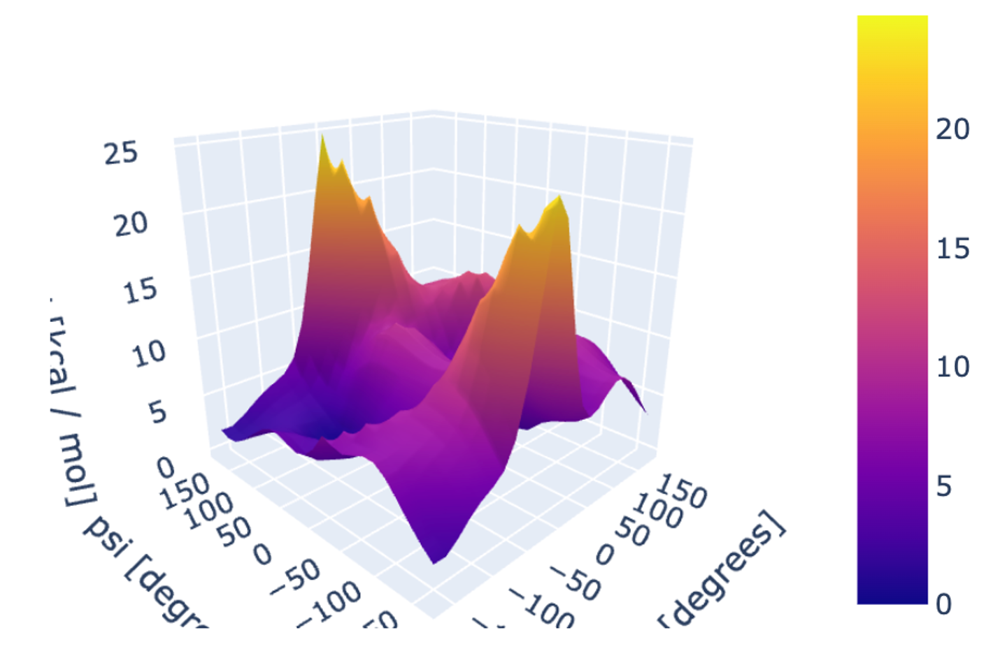
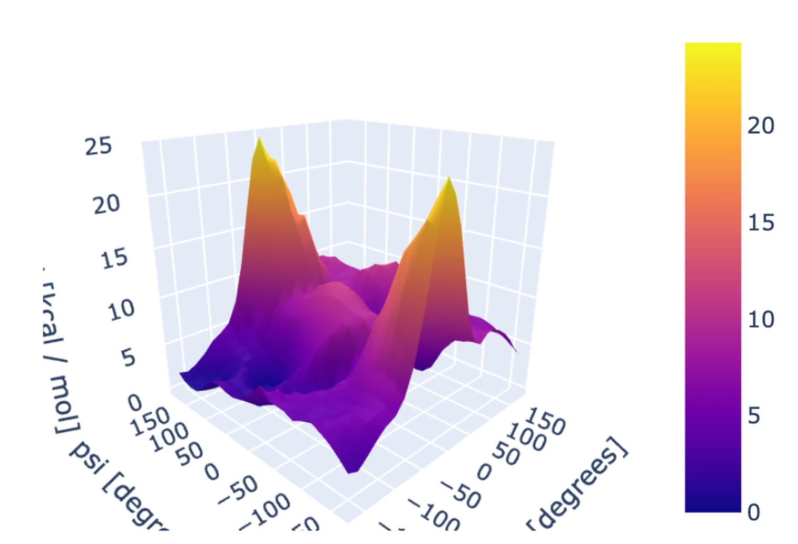

# Alanine Dipeptide Simulation

This document provides instructions for running a molecular dynamics (MD) simulation of the alanine dipeptide using LAMMPS. The simulation can be performed with or without the SHAKE algorithm to constrain bond lengths.

### 1. Generate LAMMPS Data File

Generate the LAMMPS data file from the provided PDB file (alanine-dipeptide.pdb) using the `pdb2lmp.py` script. The resulting data file will be named `alanine-dipeptide.data`.

```bash
python pdb2lmp.py alanine-dipeptide.pdb alanine-dipeptide.data
```

### 2. Equilibrate the System with NPT

Prior to the production simulation, it's necessary to relax the system to attain the correct density through an NPT simulation. Refer to the [water-NPT](../water-NPT/) example for further details about NPT simulations. For systems without bonds information (which will be used for simulations without the SHAKE algorithm), execute `run_npt.sh`. This script uses `alanine-dipeptide.data` as the initial structure and saves the final equilibrated structure as `alanine-dipeptide.npt.data`.

Below is a plot showing the system's volume, density, temperature and pressure over time:

<p align="center">
    
</p>

### 3. Run Simulation Without SHAKE

To run the simulation without SHAKE constraints, you can adjust the timestep by setting the TIMESTEP variable in the `run.sh` script. Then, execute the script to start the simulation:

```bash
./run.sh
```

### 4. Run Simulation With SHAKE Constraints

For simulations involving SHAKE constraints, a LAMMPS data file inclusive of bond information and bond coefficients needs to be generated. Use the `--bonds` option to specify the bond types (OH, CH, NH):

```bash
python pdb2lmp.py alanine-dipeptide.pdb alanine-dipeptide-bonds.data --bonds OH,CH,NH
```

Equilibration of the system through an NPT simulation is also required in this case. Execute `run_shake_npt.sh`, which employs `alanine-dipeptide-bonds.data` as the initial structure and outputs the final equilibrated structure as `alanine-dipeptide-bonds.npt.data`. For clarity, note that the SHAKE algorithm is not used during this NPT equilibration stage, as SHAKE is incompatible with simulations that change the box size, such as NPT.

Following these preparatory steps, you're now ready to run the simulation:

```bash
./run_shake.sh
```

The LAMMPS input file for the SHAKE simulation is `in.shake.lammps`. Here are the key differences between `in.shake.lammps` and the `in.lammps`:

- The `atom_style` is set to `bond`, and `bond_style zero` is added to specify zero-energy bonds for SHAKE.
- The `special_bonds` command is incorporated to include 1-2, 1-3, and 1-4 bonded pairs in the non-bonded potential neighbor lists. This step is crucial as, without it, the `pair_style ani` wouldn't be able to generate a correct neighbor list inclusive of all 1-2, 1-3, and 1-4 pairs.
- A `fix` command is added to apply the SHAKE algorithm to constrain the specified bond types.

The SHAKE algorithm allows for a larger timestep (e.g., 2 fs) without compromising stability. Without SHAKE, the simulation may fail quickly due to high-frequency bond vibrations.


### 5. Run Simulation with HMR
HMR: Hydrogen Mass Repartitioning allows a larger timestep with very easy setup

Apply HMR using openmm and generate per atom mass data file.
```
python ../apply_hmr.py alanine-dipeptide.vacuum.pdb alanine-dipeptide.vacuum.hmr_mass.data 


python ../apply_hmr.py alanine-dipeptide.pdb alanine-dipeptide.water.hmr_mass.data
echo "" >> alanine-dipeptide.water.hmr.npt.data
cat alanine-dipeptide.water.hmr_mass.data >> alanine-dipeptide.water.hmr.npt.data
```

Then copy the content of the output file into the lammps data file, `Hmrmass` section provides the per atom mass. 

Without HMR, when using a timestep of 2.3 fs in vacuum, the structure break very quickly within 100 steps.
With HMR, it runs normally even at 2.5fs.

In the input file, recenter command is very useful, otherwise the protein in vacuum will shift a lot and not easy to visulize.
```
# Keep the system's center-of-mass at the box center every timestep.
fix            3 all recenter 0.5 0.5 0.5
```

### 5. Ramachandran Plot
Generate a Ramachandran plot to visualize the distribution of the backbone dihedral angles (phi and psi) and assess the conformational states visited by the alanine dipeptide.
You could run `plot_ramachandran.py` to generate the plot. The script will read the trajectory files and plot the dihedral angles over time.

```bash
# usage: plot_ramachandran.py traj_file top_file timestep [-d DUMP_INTERVAL]
# replace 0.1 with 2 for SHAKE
# replace with your trajectory file name (.dcd file)
python plot_ramachandran.py logs/traj.dcd alanine-dipeptide.pdb 0.1 -d 100
```

The resulting plot is shown below:
|                 |           Without Shake           |               With Shake                |
| --------------- | :-------------------------------: | :-------------------------------------: |
| Timestep        |              0.1 fs               |                  2 fs                   |
| Simulation time |          5 ns (76 hours)          |            100 ns (94 hours)            |
| In Vacuum       |  |  |
| In Water        |         |         |
| In Implicit Water[^1] |  |  |

It's important to note that the current model employs a repulsion model that missing the inclusion of dispersion interactions. The absence of these interactions could impact the result of the model, potentially influencing the distribution of conformational states observed.


### 6. 2D PES Torsion Scan (in Vacuum)

The 2D PES torsion scan (in Vacuum) is performed using the `torsion_scan.ipynb` notebook. The notebook run ANI model on the QM relaxed 2D torsion scan structures from [OpenFF-Protein-Dipeptide-2D-TorsionDrive](https://github.com/openforcefield/qca-dataset-submission/tree/master/submissions/2021-11-18-OpenFF-Protein-Dipeptide-2D-TorsionDrive)


|                           QM                            |               ANI2x (Fixed Scan on QM structures)               |
| :-----------------------------------------------------: | :------------------------------------------------------: |
|  |  |
|  |  |

The MD simulation result matches to this PES scan result. Our PES is also comparable to the QM one (b3lyp-d3bj/dzvp), although ANI is trained to another level of theory (B973c/def2mTZVP).

For another reference QM calculation on Alanine Dipeptide, please refer to the paper [^2].

### 7. Conclusion

This document provides the necessary steps to run an MD simulation of the alanine dipeptide using LAMMPS, both with and without SHAKE constraints. The results can be analyzed to study the conformational dynamics of this model peptide system.

Future work includes using umbrella sampling to generate a complete ramachandran plot for alanine dipeptide.

[^1]: Implicit water model from [ani_ext](https://github.com/plin1112/ani_ext/)
[^2]: Wang, Z.; Duan, Y. Solvation Effects on Alanine Dipeptide: A MP2/cc-pVTZ//MP2/6-31G** Study of (Φ, Ψ) Energy Maps and Conformers in the Gas Phase, Ether, and Water. J. Comput. Chem. 2004, 25 (14), 1699–1716. https://doi.org/10.1002/jcc.20092.
