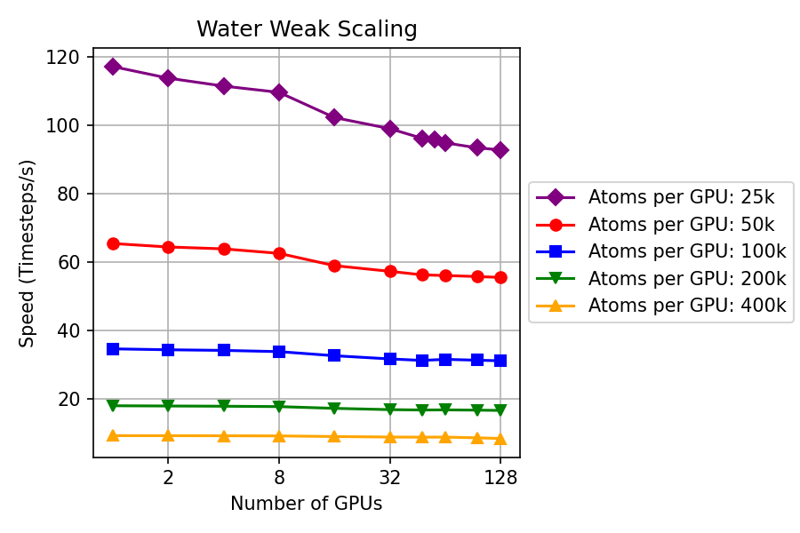
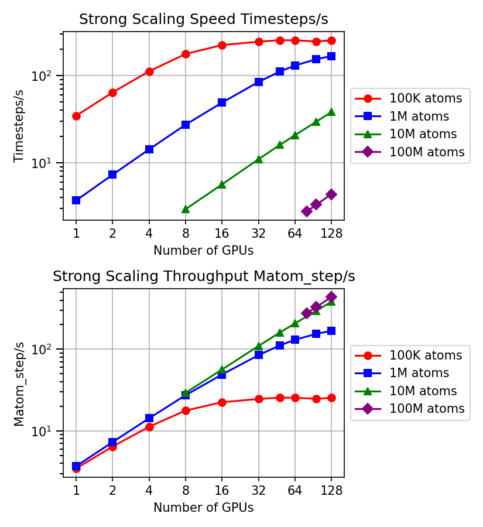
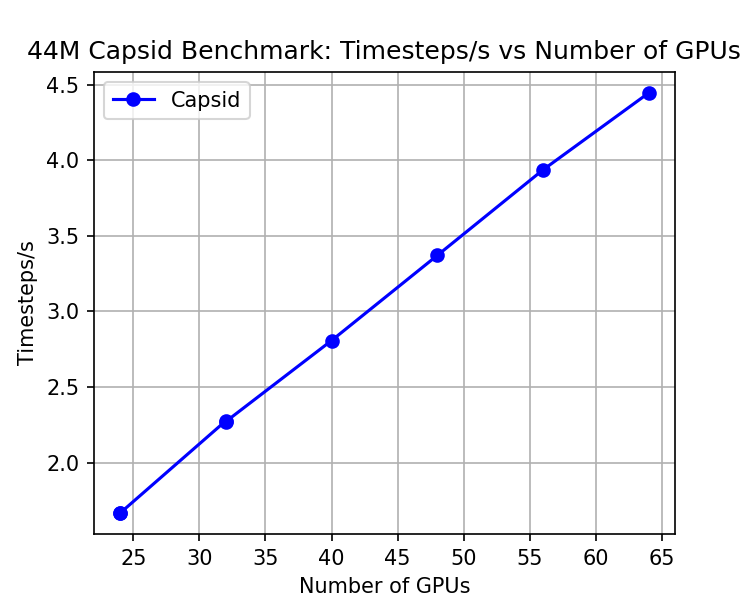
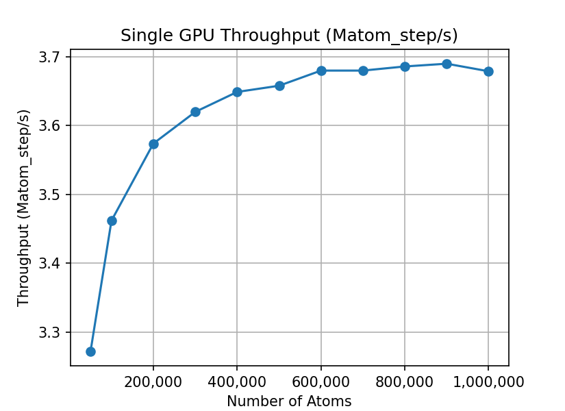

# Lammps-ANI benchmark
This document provides a detailed guide on how to conduct a benchmark test on two systems: a water box system and an HIV capsid system. The procedures for data preparation, relaxation of the water system, as well as the weak and strong scaling tests are thoroughly explained. The benchmark results are presented in tables, and the performance is also compared to the Allegro.

## Data Preparation

#### 1. Water box sysetem

Generate PDB files for water systems ranging from 50k atoms to 10M atoms by using the `generate_pdb.py` script located at `./data/water/prepare/`. The script calculates the density and utilizes packmol to build the system. Note: Generating a system with 10M atoms may take around 2 hours, while a system with 100M atoms may take up to 2 days.

After generating the PDB files, they need to be converted to LAMMPS data format. You could use the `pdb2lmp.py` script, which can be found at [../pdb2lmp.py](../pdb2lmp.py). Here's an example of how to use it:

```bash
python path/to/pdb2lmp.py water.pdb water.data
```

Finally, move all the generated LAMMPS data files from `data/water/prepare` to the `data/water` folder.

#### 2. HIV Capsid System

For the HIV capsid system, we obtained the structures from Gregory Voth. There are two PDB files:
- `data/capsid-aa/capsid-cone.pdb` onsisting of 70M atoms, with 65.6M of them being water.
- `data/capsid-aa/capsid5/capsid-pill.pdb` consisting of 44M atoms, with 40M of them being water. This system is the one we used for the benchmark.

These PDB files require some pre-processing, which can be done using the `clean_pdb.py` script located at `data/capsid-aa/capsid5`. The script removes SOD and CLA residues and adds an element symbol to each atom in the PDB. This way, the ASE (Atomic Simulation Environment) can read the PDB correctly.

Then, like the water system, convert the PDB files to LAMMPS data files using the `pdb2lmp.py` script. The final LAMMPS data file for the HIV capsid system will be saved at `data/capsid-aa/capsid5/capsid-pill-cleaned.data`.

## Relaxation of the Water System
After preparing the data, the water system needs to be relaxed. For this, run LAMMPS with the NVT ensemble for 5k steps. This will relax the system and stabilize the temperature at 300K. For instance:

```bash
python run_one.py data/water/water-50k.data --kokkos --num_gpus=4 --run_steps=5000 --input_file=in.relax.lammps --log_dir=log_water_relax --run
```

The number of GPUs can be adjusted based on the size of the system. For smaller systems, each job typically finishes within a few minutes. Once the relaxation is complete, the final state is saved as `.final` file, e.g. `data/water/water-50k.data.final`, and is ready for benchmarking.

## Weak Scaling
Weak scaling benchmarks are used to evaluate the ability of a system to maintain its performance as the size of the problem increases proportionally to the resources. Ideally, when both the problem size and resources are doubled, performance should remain constant.

The water system's weak scaling was conducted for four workload sizes per GPU (50k, 100k, 200k, 400k). The number of GPUs was increased from 1 to 48. The test configuration involved kokkos, single precision (FP32), a timestep of 0.5, and a single model. Benchmarking was conducted on Hipergator with 8 A100 GPUs per node.

System scaling was achieved using the `replicate` command in LAMMPS. To run the benchmark, use the following command:
```bash
python submit_scaling.py data/water-200k.data.final
```

Benchmark results are collected in the [csv](log_water_weak_scaling/all.csv) file.

Here is the plot

<p align="center">
    
</p>

As the number of GPUs increases, the number of timesteps per second remains relatively constant for each group of atoms per GPU. This shows good weak scaling, as the problem size increases, the simulation is able to effectively utilize additional resources to maintain performance.

<!-- TODO need to fix this -->
For a comparison, our implementation achieved around 9 timesteps/second with 400k atoms per GPU using FP32 precision. In contrast, the Allegro system achieved approximately 8 timesteps/second with a lesser workload of 12.5k atoms per GPU, even though it uses a potentially more performant TF32 precision for matrix operations.

## Strong Scaling
Strong scaling, also known as scale-up, is a concept in parallel computing that measures the performance improvement of a system as more resources (like processors or GPUs) are added, while keeping the total problem size or workload constant. In other words, solve a fixed-size problem faster with more GPUs.

We conducted benchmarks on three systems consisting of 300k, 1M, and 10M atoms respectively, and increased the number of GPUs from 1 to 56.

To execute the benchmark, use the following command:
```bash
python submit_scaling.py data/water-200k.data.final
```

| atoms     | num_gpus | ns/day | timesteps/s | Matom_step/s |
|-----------|----------|--------|-------------|--------------|
| 100002    | 1        | 1.495  | 34.618      | 3.462        |
| 100002    | 2        | 2.774  | 64.213      | 6.421        |
| 100002    | 4        | 4.846  | 112.173     | 11.218       |
| 100002    | 8        | 7.663  | 177.377     | 17.738       |
| 100002    | 16       | 9.69   | 224.308     | 22.431       |
| 100002    | 32       | 10.613 | 245.668     | 24.567       |
| 100002    | 48       | 11.029 | 255.306     | 25.531       |
| 100002    | 64       | 10.98  | 254.165     | 25.417       |
| 100002    | 96       | 10.668 | 246.935     | 24.694       |
| 100002    | 128      | 10.986 | 254.304     | 25.431       |
| 1000002   | 1        | 0.159  | 3.684       | 3.684        |
| 1000002   | 2        | 0.315  | 7.287       | 7.287        |
| 1000002   | 4        | 0.615  | 14.24       | 14.24        |
| 1000002   | 8        | 1.182  | 27.354      | 27.354       |
| 1000002   | 16       | 2.118  | 49.038      | 49.038       |
| 1000002   | 32       | 3.659  | 84.695      | 84.695       |
| 1000002   | 48       | 4.823  | 111.634     | 111.634      |
| 1000002   | 64       | 5.643  | 130.633     | 130.633      |
| 1000002   | 96       | 6.679  | 154.603     | 154.603      |
| 1000002   | 128      | 7.259  | 168.026     | 168.026      |
| 10000002  | 8        | 0.126  | 2.927       | 29.267       |
| 10000002  | 16       | 0.244  | 5.646       | 56.461       |
| 10000002  | 32       | 0.474  | 10.976      | 109.76       |
| 10000002  | 48       | 0.693  | 16.035      | 160.35       |
| 10000002  | 64       | 0.896  | 20.748      | 207.476      |
| 10000002  | 96       | 1.28   | 29.627      | 296.267      |
| 10000002  | 128      | 1.655  | 38.302      | 383.018      |
| 100000002 | 80       | 0.119  | 2.753       | 275.299      |
| 100000002 | 96       | 0.143  | 3.302       | 330.198      |
| 100000002 | 128      | 0.188  | 4.355       | 435.457      |


Here is the plot

<p align="center">
    
</p>

For all system sizes, the performance increases as the number of GPUs increases, indicating that the problem scales well across multiple GPUs. This is expected in a strong scaling scenario, where we keep the problem size constant and increase the resources (GPUs, in this case).

The performance gain seems to taper off as the number of GPUs increases, especially for the smaller system sizes (300k and 1M atoms). This could be due to increased communication overhead as more GPUs are used, or it might be that these smaller system sizes are not large enough to fully utilize the increased compute resources.

For the largest system size (10M atoms), the performance keeps increasing even at the highest number of GPUs tested (56 GPUs). This suggests that this larger problem size is able to better utilize the additional GPUs, and it could potentially benefit from even more GPUs.

For comparative purposes, consider the following:

| Name    | # of Atoms | System | # of GPUs | Speed (timesteps/sec) | Precision |
|---------|------------|--------|-----------|-----------------------|-----------|
| ANI     | 1M         | Water  | 48        | 112                   | FP32      |
| Allegro | 1M         | Water  | 2048      | 100                   | TF32      |
| ANI     | 100K       | Water  | 4         | 112                   | FP32      |
| Allegro | 100K       | Water  | 256       | ~110                  | TF32      |

<!-- | ANI     | 1M         | Water  | 64        | 131                   | TF32      | -->
<!-- | Allegro | 1M         | Water  | 64        | 6.5                   | TF32      | -->

## 44M Bio-system of Capsid
In this section, we will explore the performance of our benchmark run on a large biological system - a capsid with 44M atoms. The benchmark can be executed using the following command:

```bash
python submit_scaling.py data/capsid-aa/capsid5/capsid-pill-cleaned.data
```

Below is the performance data collected from the benchmark runs:

| atoms    | num_gpus | ns/day | timesteps/s | Matom_step/s |
|----------|----------|--------|-------------|--------------|
| 43911876 | 24       | 0.072  | 1.667       | 73.215       |
| 43911876 | 32       | 0.098  | 2.276       | 99.946       |
| 43911876 | 48       | 0.146  | 3.37        | 147.964      |
| 43911876 | 64       | 0.192  | 4.445       | 195.173      |
| 43911876 | 96       | 0.281  | 6.515       | 286.102      |
| 43911876 | 128      | 0.369  | 8.542       | 375.111      |


<p align="center">
    
</p>

The results demonstrate an increasing performance trend as the number of GPUs are augmented. Despite the large size of the capsid system, the strong scaling performance continues to improve with more resources, suggesting good scalability of the algorithm in large systems.

For a comparison:

| Name    | # of Atoms | System | # of GPUs | Speed (timesteps/sec) | Precision |
|---------|------------|--------|-----------|-----------------------|-----------|
| ANI     | 44M        | Capsid | 56        | 3.9                   | FP32      |
| Allegro | 44M        | Capsid | 2048      | 3.9                   | TF32      |
| ANI     | 44M        | Capsid | 128       | 8.5                   | FP32      |
| Allegro | 44M        | Capsid | 5120      | 8.7                   | TF32      |

## Single GPU Saturation Test
The goal of this benchmarking is to determine the saturation point of a single GPU, beyond which increasing the system size does not yield further performance improvement.

| atoms   | ns/day | timesteps/s | Matoms_step/s |
|---------|--------|-------------|---------------|
| 50001   | 2.827  | 65.446      | 3.272         |
| 100002  | 1.495  | 34.617      | 3.462         |
| 200001  | 0.772  | 17.869      | 3.574         |
| 300003  | 0.521  | 12.065      | 3.62          |
| 400002  | 0.394  | 9.122       | 3.649         |
| 500001  | 0.316  | 7.315       | 3.658         |
| 600000  | 0.265  | 6.133       | 3.68          |
| 700002  | 0.227  | 5.257       | 3.68          |
| 800001  | 0.199  | 4.608       | 3.686         |
| 900000  | 0.177  | 4.1         | 3.69          |
|1000002.0| 0.159  | 3.679       | 3.679         |

<p align="center">
    
</p>

The results indicate that the performance saturation point for the single GPU occurs around the system size of 500k atoms, at which point the performance plateaus at approximately 3.68 Matoms_step/s. With this information, we believe that performance can be enhanced further by optimizing certain factors like reducing memory reallocation and CPU synchronization. Future work should focus on these areas to exploit the full potential of single GPU performance using CUDA graph.

## Future works

CUDA graph could potentially help us to improve the performance of the code by launching many kernels in a graph and execute them in a single launch. Relevant resources and ongoing work in this area are detailed in the following articles:
- [A Guide to CUDA Graphs in GROMACS 2023 | NVIDIA Technical Blog](https://developer.nvidia.com/blog/a-guide-to-cuda-graphs-in-gromacs-2023/)
- [Implement CUDA Graph functionality and perform associated refactoring (#4277) · Issues · GROMACS / GROMACS · GitLab](https://gitlab.com/gromacs/gromacs/-/issues/4277)

However there are some challenges we need to adress. The main issue is that the tensor shapes should be fixed in the graph. But in our case, the tensor shapes are changing during the simulation. This is because the number of atoms and the number of pairs are changing during the simulation. By fixing the tensor shapes, we could also potentially avoid the memory reallocation overheads. 

To give some number on the tensor size, consider a scenario with 600,000 atoms. The AEV would be 600,000 (number of atoms) multiplied by 1,000 (number of AEV), resulting in 600,000,000 floats, or 1.2GB. For a system with 1,000,000 atoms, the requirement would escalate to 1,000,000,000 floats, or 4GB.

Turning to our neural network, if we have 333,000 hydrogen and 166,000 oxygen atoms, these quantities remain constant since they correspond to local atoms, which do not diminish or grow over time. The forces, however, do change as they take into account the forces on ghost atoms.

The number of pairs is another factor that primarily influences AEV calculations. Although not large, it stands at 74,000,000 integers or 296MB. Addressing this fluctuation demands a fundamental change in cuaev in terms of how neighbors are stored, which is a time-consuming and challenging task.
