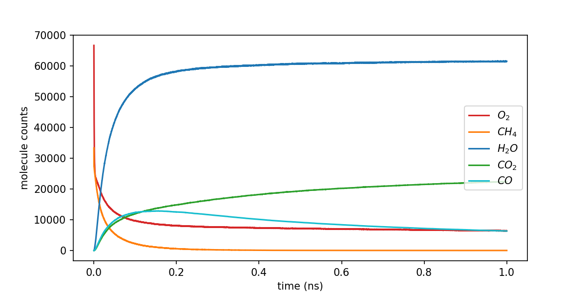

Setup
- Combustion Reaction (CH4 + 2O2 = CO2 + 2H2O, CH4 + 1.5O2 = CO + 2H2O)
- 300k atoms (66k O2 + 33k CH4)
- ANI2x + Repulsion Model
- Use 8 A100 GPUs, 1 single model, single precision, with kokkos, - timestep 0.5 fs
- Timing: 7.1 hours for 1.0 ns. Performance: 3.396 ns/day (or 78.606 timesteps/s)

Run 300k system
```bash
python run_one.py prepare_system/combustion-0.25-300k.data --kokkos --num_gpus=8 --input_file=in.lammps --log_dir=logs --ani_model_file='ani2x_repulsion.pt' --run_name=combustion_300k --ani_num_models=1 --timestep=0.5 --run_steps=2000000 --run
```

Analyze 
```bash
python analyze.py prepare_system/combustion-0.25-300k.pdb logs/2023-09-25-125628.988569.dcd -t 0.5 -i 100 -b 1
```


Result:



