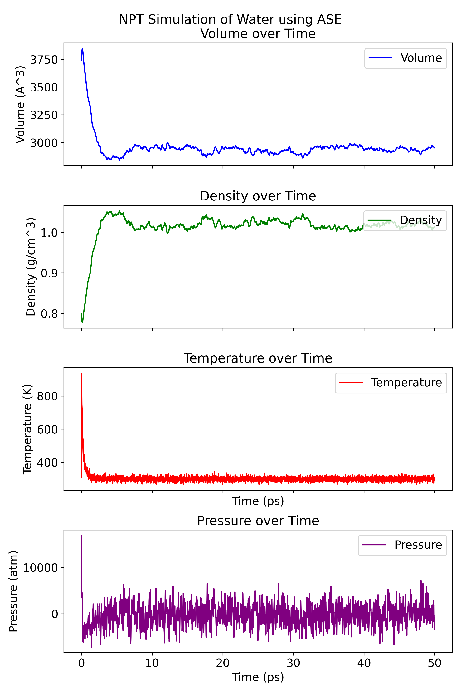
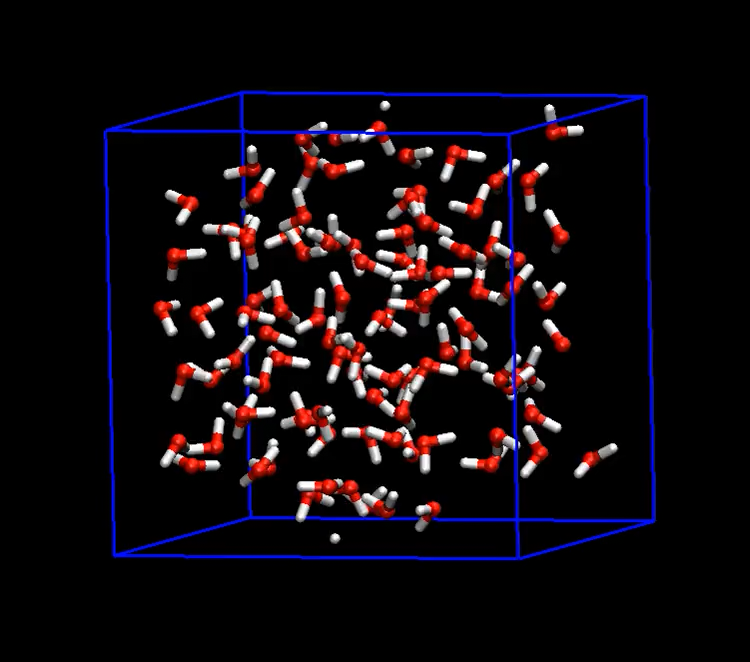

## Introduction
This example demonstrates how to perform an NPT simulation of water using the LAMMPS-ANI interface.

## Background
There are two methods for computing stress in molecular dynamics simulations. 

The first approach[^1] computes stress by applying the dot product of total forces (per atom) and the displacement vector. This method is suitable for non-periodic boundary systems and is expressed as:

$$
P=\frac{N k_{\mathrm{B}} T}{V}+\frac{1}{3 V}\left\langle\sum_{i=1}^N \mathbf{r}_i \cdot \mathbf{f}_i\right\rangle
$$

To adapt this approach for a periodic boundary system, an additional term accounting for the box lengths is required:

$$
P=\frac{N k_{\mathrm{B}} T}{V}+\left\langle\frac{1}{3 V} \sum_{i=1}^N \mathbf{r}_i \cdot \mathbf{f}_i-\frac{1}{3 L^2} \frac{\partial U}{\partial L}\right\rangle
$$

This method has been implemented in the current torchani stress calculation as shown here: https://github.com/aiqm/torchani/pull/218, https://github.com/aiqm/torchani/pull/387.

The second approach[^2], referred to as the partial_fdotr method, does not require the cell's box information and is therefore suitable for use in the LAMMPS interface. In this scenario, the model only requires the neighbor list (local atoms, ghost atoms), with no need for the cell's information. This approach can be applied across multiple domains and is scalable on multi-GPUs. This method is expressed as:


$$
P=\frac{N k_{\mathrm{B}} T}{V}+\frac{1}{6 V}\left\langle 
\sum_{i=1}^N \sum_{j \neq i}^N r_{i j} \cdot f_{i j}
\right\rangle
$$

This approach is universally applicable and should work with all types of potentials, including 2-body (radial), 3-body (angular), repulsion, dispersion, and so on. To use this method, the very first displacement vector must be saved and be differentiable.

## LAMMPS vs ASE

To compare the NPT simulations performed using LAMMPS and ASE, two sets of simulations were carried out. The LAMMPS simulation was executed using the provided `run_lammps.sh` script, while the ASE simulation was executed using the `run_ase.py` script.

After running the simulations, the resulting data was plotted, including the volume, density, temperature, and pressure. 

Run Lammps
```bash
./run_lammps.sh
# plot the volume, density, temperature and pressure
python plot_lammps.py lammps_logfile
```

Run ase
```bash
python run_ase.py
# plot the volume, density, temperature and pressure
python plot_ase.py ase_logfile
```

The generated plots for the LAMMPS and ASE simulations are shown below:

| LAMMPS Simulation | ASE Simulation |
|:-----------------:|:--------------:|
|  |  |

The results obtained from both simulations are in close agreement, indicating that the NPT simulations using the LAMMPS-ANI interface and ASE yield comparable results. The simulations were performed on A100 GPUs. In this setting, the ASE simulation took a substantial amount of time, finishing in 386 minutes, whereas the LAMMPS simulation completed in 53 minutes, which is more than 7 times faster than the ASE simulation.

Here is a visualization of the LAMMPS simulation in the initial 5 picoseconds:
<p align="center">
  <a href="resc/lammps.mp4">
    
  </a>
</p>

## Repulsion model
Work in progress: The NPT simulation with the repulsion model is still under development. Currently, there are some issues, and the final density does not reach the expected value of 0.8 g/cm³. This discrepancy could potentially be attributed to the exclusion of dispersion interactions in the current implementation.

## Multi-GPU tests
The performance and scalability of the NPT simulation using the LAMMPS-ANI interface were evaluated across multiple GPUs. A simulation was conducted using 2 GPUs, and the results were consistent with the single GPU simulation.

## Limitatoins
It is important to note that the current implementation of stress/pressure calculation in the LAMMPS-ANI interface only works with PyAEV. CUAEV is not compatible with stress/pressure calculations at this time.


[^1]: Louwerse, M. J.; Baerends, E. J. Calculation of Pressure in Case of Periodic Boundary Conditions. Chem Phys Lett 2006, 421 (1–3), 138–141. https://doi.org/10.1016/j.cplett.2006.01.087.  
[^2]: Thompson, A. P.; Plimpton, S. J.; Mattson, W. General Formulation of Pressure and Stress Tensor for Arbitrary Many-Body Interaction Potentials under Periodic Boundary Conditions. J Chem Phys 2009, 131 (15), 154107. https://doi.org/10.1063/1.3245303.

